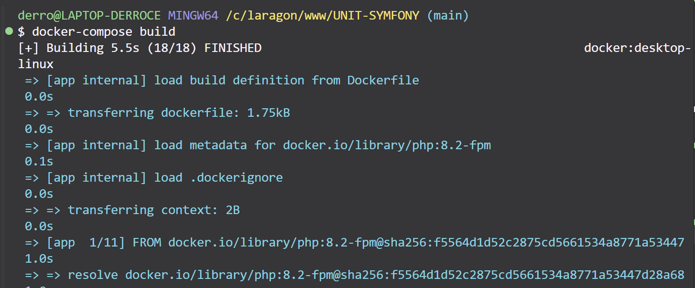

# Configuration Docker pour Symfony

Ce projet utilise Docker pour créer un environnement de développement Symfony. Voici les explications détaillées des différents services et configurations.

## Structure des Services Docker

Le fichier `docker-compose.yml` définit les services suivants :

### Service PHP-FPM (symfony_app)
```yaml
app:
    image: php:8.2-fpm
    build:
      context: .
      dockerfile: Dockerfile
    volumes:
      - ./app:/var/www/html
```
Service principal qui exécute l'application PHP avec PHP-FPM 8.2.

### Service Nginx (symfony_webserver)
```yaml
webserver:
    image: nginx:stable
    ports:
      - "8080:80"
    volumes:
      - ./app:/var/www/html
      - ./nginx:/etc/nginx/conf.d
```
Serveur web qui gère les requêtes HTTP, accessible sur le port 8080.

### Service MySQL (symfony_db)
```yaml
database:
    image: mysql:8.0
    environment:
      MYSQL_DATABASE: symfony
      MYSQL_ROOT_PASSWORD: root
      MYSQL_USER: symfony
      MYSQL_PASSWORD: symfony
    ports:
      - "3306:3306"
```
Base de données MySQL 8.0 pour stocker les données de l'application.

### Outils d'Administration de Base de Données

#### Adminer (symfony_adminer)
```yaml
adminer:
    image: adminer
    ports:
      - "8081:8080"
```
Interface d'administration de base de données légère, accessible sur http://localhost:8081

#### phpMyAdmin (symfony_phpmyadmin)
```yaml
phpmyadmin:
    image: phpmyadmin/phpmyadmin
    ports:
      - "8082:80"
```
Interface alternative d'administration MySQL, accessible sur http://localhost:8082

### Service Node.js (symfony_node)
```yaml
node:
    image: node:latest
    working_dir: /var/www/html
    ports:
      - "8083:8083"
    command: bash -c "npm install && npm run watch"
```
Service pour la compilation des assets et le rechargement automatique en développement.

## Configuration du Projet

### Dockerfile
Le Dockerfile configure l'environnement PHP avec :
- PHP 8.2-FPM
- Extensions PHP nécessaires (pdo_mysql, intl, etc.)
- Optimisations de performance (OPcache)
- Configuration PHP optimisée pour le développement

### Webpack Encore
Le projet utilise Webpack Encore pour la gestion des assets :
- Compilation automatique des fichiers CSS/JS
- Rechargement automatique en développement
- Support de Stimulus pour les composants JavaScript

## Captures d'écran du Projet

### Interface de Connexion

L'interface de connexion permet aux utilisateurs de s'authentifier avec leur email et mot de passe. Elle propose également un lien pour créer un nouveau compte.

### Interface d'Inscription

Le formulaire d'inscription permet aux nouveaux utilisateurs de créer un compte en fournissant leur email et en choisissant un mot de passe.

## Utilisation

1. Clonez le projet
2. Lancez l'environnement :
```bash
docker-compose up -d
```
3. Installez les dépendances :
```bash
docker exec -it symfony_app composer install
docker exec -it symfony_node npm install
```
4. Accédez à l'application :
   - Application : http://localhost:8080
   - Adminer : http://localhost:8081
   - phpMyAdmin : http://localhost:8082

## Développement

Pour le développement, le projet inclut :
- Rechargement automatique des assets (via Webpack Encore)
- Configuration de développement PHP optimisée
- Outils de débogage et d'administration de base de données
- Logs détaillés pour le débogage